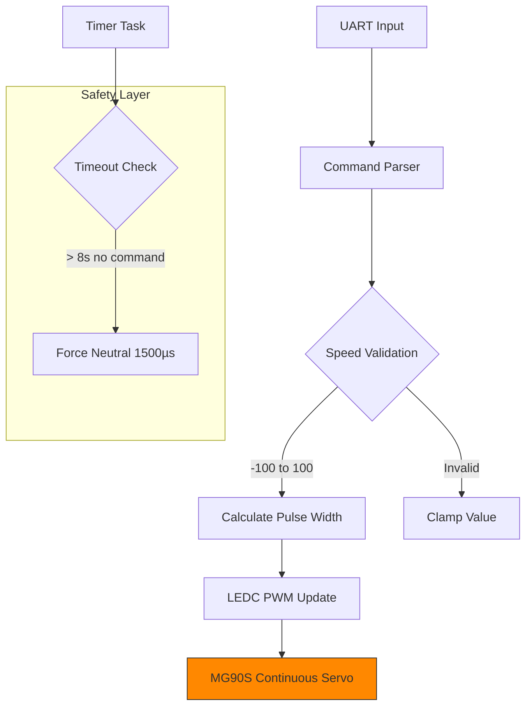

# ESP32-S3 Continuous Rotation MG90S Servo Controller

Firmware for driving a **continuous-rotation MG90S** servo using the ESP32-S3 (DevKitC-1 / N16R8).  
Built with **ESP-IDF** in PlatformIO

## Overview

This project demonstrates embedded practices for actuator control:
- Precise LEDC PWM generation for servo signaling
- UART command interface for real-time speed control
- Safety timeout and input sanitization
- Clean separation of concerns using FreeRTOS

---

## Features

- Speed control from **-100% to +100%**
- Smooth pulse-width mapping (1500 µs neutral)
- Automatic safety timeout (stops after 8 seconds of inactivity)
- Robust UART command parsing with input cleaning
- Production-ready error checking (`ESP_ERROR_CHECK`)
- Low-level hardware peripheral configuration (LEDC)

## Hardware Requirements

| Component              | Details                              |
|------------------------|--------------------------------------|
| Microcontroller        | ESP32-S3-DevKitC-1 (N16R8)           |
| Servo                  | MG90S (Continuous Rotation variant)  |
| Power Supply           | **External 5V** (recommended 1A+)    |
| Decoupling             | 470 µF low-ESR electrolytic + 0.1 µF ceramic across servo power |
| Signal Pin             | GPIO18                               |

> **Warning**: Never power the servo directly from the ESP32's 3.3V or onboard regulator.

## Wiring
Servo Wire     → ESP32-S3

Orange/Yellow  → GPIO18 (PWM Signal)

Red            → External +5V

Brown          → Common GND (with ESP32)


## Building & Flashing

```bash
# Clean and build
platformio run --target clean
platformio run

# Upload and monitor
platformio run --target upload
platformio device monitor
```


## Usage
Open the serial monitor (115200 baud) and send integer speed commands:


| Command      | Behavior             |
|--------------|----------------------|
| 100          | Full speed forward   |       
| 50           | Medium forward       |
| 0            | Stop (neutral)       |
| -30          | Medium reverse       |
| -100Full     | speed reverse        |

The servo will automatically stop after 8 seconds of no commands.

## System Architecture



## Pulse Width Mapping

- **1500 µs** → Stop / Neutral  
- **800 µs** → Full speed one direction  
- **2200 µs** → Full speed opposite direction  


## Future Enhancements

- FreeRTOS queue + dedicated command task
- MOSFET power gating for zero quiescent current
- Stall/current detection using INA219 or shunt resistor
- NVS-based speed calibration
- MCPWM instead of LEDC for higher precision / multi-servo support

#### Author: Hamed Madadian