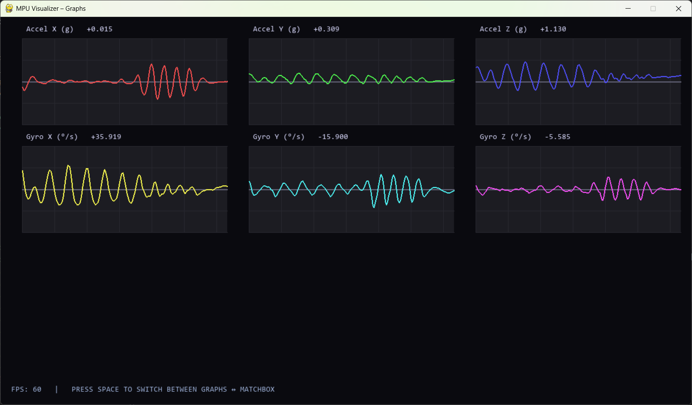
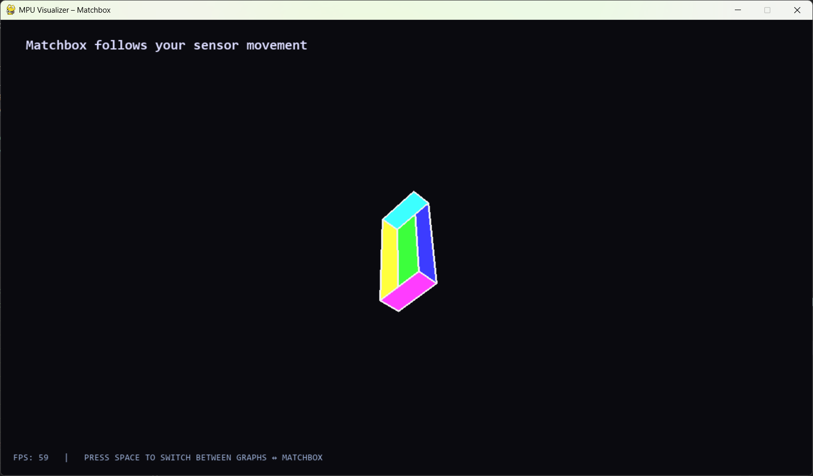
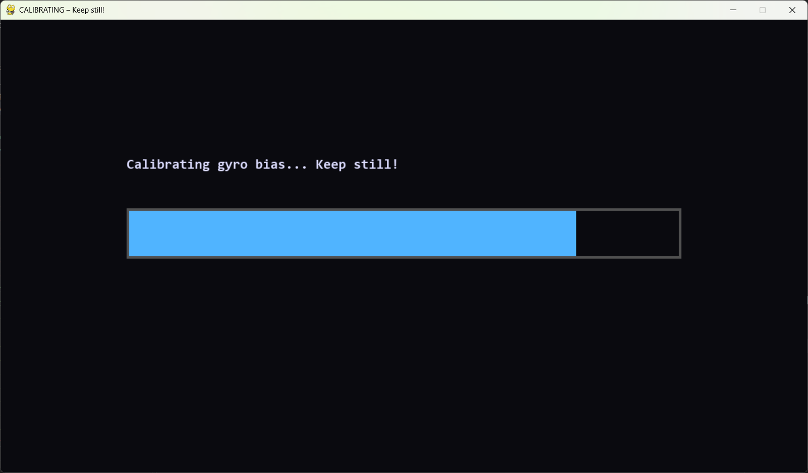

# ESP32-C3 MPU-9250 Real-Time Visualizer & Data Stream

**Real-time IMU streaming and visualization prototype**  
Built on **ESP32-C3 Super Mini** with MPU-6500 sensor, demonstrating production-grade embedded design principles.

## Project Overview

This project implements a **minimal, high-performance real-time data pipeline** from an IMU sensor to a desktop visualization tool.

**Embedded side (C firmware)**  
- Reads MPU-6500 (accelerometer + gyroscope) at a fixed 50 Hz rate  
- Sends structured, low-latency CSV-like data over USB CDC  
- Uses deterministic timing, zero heap allocation in hot path, robust I2C initialization

**Desktop side (Python + Pygame)**  
- Real-time 6-channel graphs with true zero reference lines and live numerical values  
- 3D matchbox (colored rectangular prism) showing physical orientation  
- Automatic gyro bias calibration at startup (keep sensor still for 3 seconds)  
- Clean UI with dark theme, FPS counter, and clear mode-switching instructions

### Key Production Design Decisions

- **Embedded**  
  - Fixed 20 ms update interval using `micros()` → no blocking `delay()`  
  - Structured output (`MPU,ax,ay,az,gx,gy,gz`) → easy, unambiguous parsing  
  - Long boot delay + safe I2C init → eliminates USB CDC + I2C peripheral race  
  - No dynamic memory in loop → zero fragmentation risk

- **Visualization**  
  - Fixed physical scales (±8 g accel, ±500 °/s gyro) → consistent reference, no misleading auto-zoom   
  - Live value display → essential for engineering diagnostics  
  - Calibration phase with progress bar → prevents initial wild spinning  


## Hardware Setup

- **Board**: ESP32-C3 Super Mini  
- **Sensor**: MPU-6500 (AD0 to GND → address 0x68)  
- **Wiring**:
  - SDA → GPIO 8  
  - SCL → GPIO 9  
  - VCC → 3V3  
  - GND → GND  

**Note**: No external pull-ups required if MPU module has them built-in (most do).

## Software Requirements


### Desktop (Python)

```bash
pip install pygame pyserial numpy scipy
```

## How to Run

1. **Upload firmware**  
   Connect board → `pio run --target upload`

2. **Start visualizer**  
   ```bash
   python mpu_visualizer.py
   ```

3. **Calibration**  
   Keep sensor **completely still** for ~3 seconds at startup  
   Progress bar appears on screen

4. **Controls**  
   - **SPACE** → switch between Graphs ↔ Matchbox view  
 

## Screenshots

### 1. Graphs View  
Real-time plots with true zero lines, live numerical values, and fixed physical scales



### 2. Matchbox View  
Colored rectangular prism (matchbox style) following physical sensor orientation



### 3. Calibration Phase  
Keep-still progress bar during gyro bias calculation




## License

MIT License – use, modify, share freely.

## Author
Hamed Madadain
eng.madadian@gmail.com