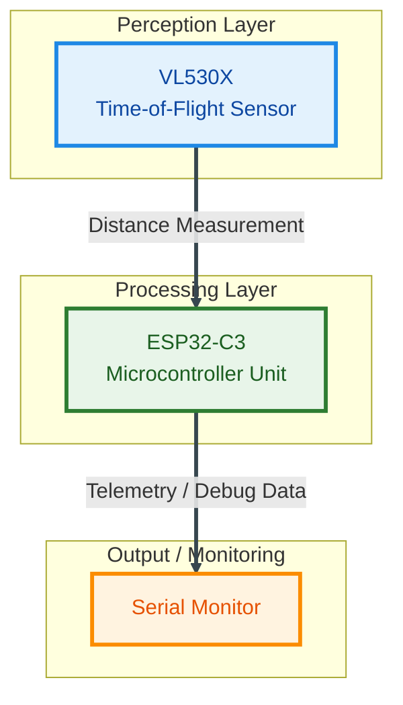

```mermaid
flowchart TD

%% ---------- Styles ----------
classDef sensor fill:#E3F2FD,stroke:#1E88E5,stroke-width:3px,color:#0D47A1
classDef mcu fill:#E8F5E9,stroke:#2E7D32,stroke-width:3px,color:#1B5E20
classDef interface fill:#FFF3E0,stroke:#FB8C00,stroke-width:3px,color:#E65100

linkStyle default stroke:#37474F,stroke-width:3px

%% ---------- System Architecture ----------
subgraph PERCEPTION_LAYER["Perception Layer"]
    direction LR
    TOF["VL530X<br>Time-of-Flight Sensor"]
end

subgraph PROCESSING_LAYER["Processing Layer"]
    direction LR
    MCU["ESP32-C3<br>Microcontroller Unit"]
end

subgraph OUTPUT_LAYER["Output / Monitoring"]
    direction LR
    SERIAL["Serial Monitor"]

end

%% ---------- Data Flow ----------
TOF -->|Distance Measurement| MCU
MCU -->|Telemetry / Debug Data| SERIAL


%% ---------- Class Assignment ----------
class TOF sensor
class MCU mcu
class SERIAL,SCREEN interface
```