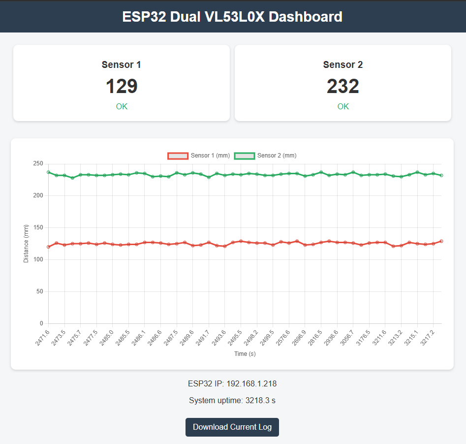
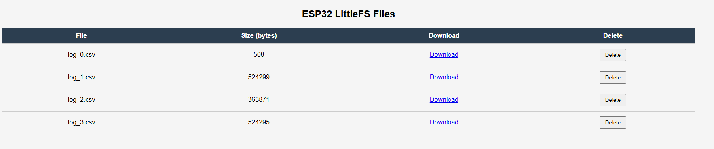
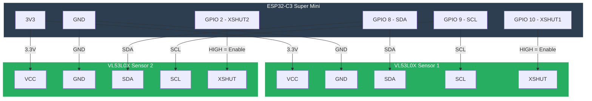
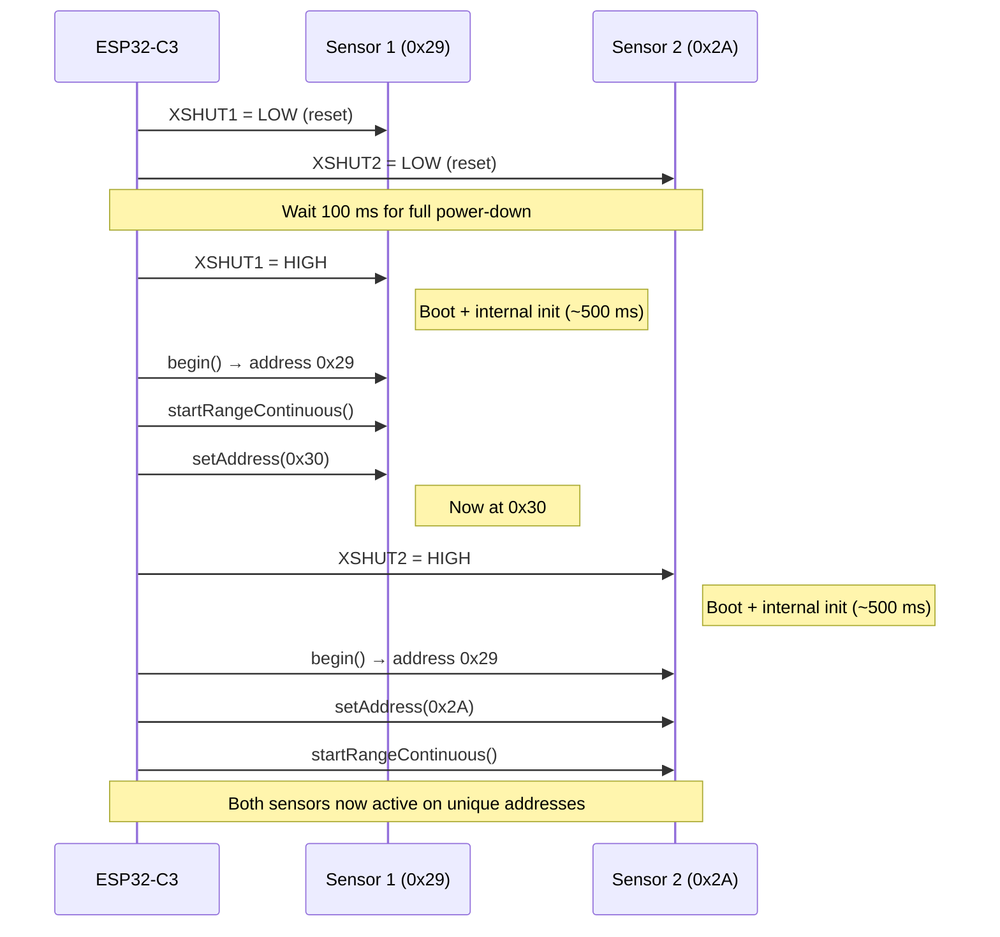
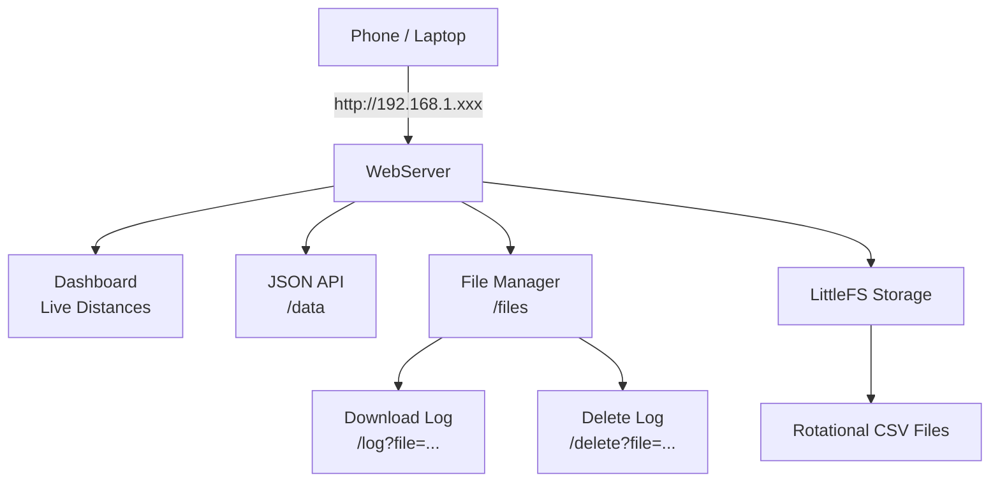

# ESP32-C3 Dual VL53L0X ToF Distance Monitor & Logger

IoT prototype for reading two VL53L0X Time-of-Flight distance sensors, displaying live measurements on a phone-accessible web dashboard, and storing timestamped readings persistently on the device with automatic file rotation.

## Features

- **Two VL53L0X sensors** on shared I2C bus with dynamic address assignment via XSHUT pins
- **Continuous ranging** mode at ~4 Hz update rate
- **Live web dashboard** showing real-time distances (accessible from phone on local WiFi)
- **CSV logging** to LittleFS with automatic rotation (new file when size exceeds 512 KB)
- **File manager page** for browsing, downloading, and deleting logs directly from browser
- **JSON API endpoint** (`/data`) for live sensor data
- **WiFi credentials** safely stored in `secrets.h` 
- **Robust error handling** and detailed serial logging with millisecond timestamps

## Hardware Setup

### Required Components

- ESP32-C3 Super Mini development board
- 2 × VL53L0X Time-of-Flight sensor modules (GY-VL53L0XV2 or similar)
- Jumper wires

### Pin Connections

| Signal       | ESP32-C3 Pin | Notes                                      |
|--------------|--------------|--------------------------------------------|
| I2C SDA      | GPIO 8       | Shared data line                           |
| I2C SCL      | GPIO 9       | Shared clock line                          |
| Sensor 1 XSHUT | GPIO 10    | High = enabled (default address 0x29)      |
| Sensor 2 XSHUT | GPIO 2     | High = enabled (changed to 0x2A)           |
| VCC (both)   | 3V3          | 2.8–3.3 V recommended                      |
| GND (both)   | GND          | Common ground                              |

## Screenshots

### 1. Live Dashboard (phone-accessible web interface)

*Real-time distances, status indicators, and auto-refreshing chart*

### 2. File Manager Web Page

*Browse, download, and delete stored log files directly from browser*

## Software Architecture

### Embedded Firmware (C)

- **Sensor handling**: Continuous ranging mode, dynamic I2C address assignment
- **Logging**: CSV format with timestamp, distances, and status codes
- **Rotation**: New file created when current file exceeds 512 KB
- **Web server**: HTTP endpoints for dashboard, JSON data, file list, download, delete
- **Credentials**: Stored in `include/secrets.h` 

### Filesystem (LittleFS)

- Persistent storage on internal flash (~1.5 MB usable)
- Survives power cycles
- Rotational CSV files prevent unbounded growth
- Files retrievable via USB (`pio run --target downloadfs`) or web interface

## Data Flow, and Hardware Diagrams
### 1. Hardware Diagram

### 2. High-Level System Architecture

### 3.  Web Access & Retrieval Flow

